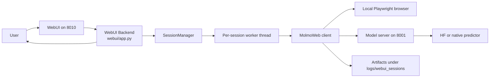

# MolmoWeb Setup On My Linux Machine

This file captures the exact setup flow that worked in this repository on Linux with a conda environment named `molmoweb`.

## 1. Create And Use The Conda Environment

```bash
conda create -n molmoweb python=3.10 -y
conda activate molmoweb
conda install -c conda-forge uv -y
```

## 2. Keep uv And Playwright Inside The Conda Environment

```bash
export UV_PROJECT_ENVIRONMENT="$CONDA_PREFIX"
export UV_CACHE_DIR="$CONDA_PREFIX/.uv-cache"
export PLAYWRIGHT_BROWSERS_PATH="$CONDA_PREFIX/.playwright"
```

If you want those variables every time the environment is activated:

```bash
conda env config vars set UV_PROJECT_ENVIRONMENT="$CONDA_PREFIX"
conda env config vars set UV_CACHE_DIR="$CONDA_PREFIX/.uv-cache"
conda env config vars set PLAYWRIGHT_BROWSERS_PATH="$CONDA_PREFIX/.playwright"
conda deactivate
conda activate molmoweb
```

## 3. Install The Python Dependencies

```bash
uv sync
```

## 4. Install Playwright Browsers

```bash
uv run playwright install
uv run playwright install --with-deps chromium
```

On Ubuntu 24.04, Playwright may still request `libasound2`, while the package you actually need is `libasound2t64`.
If `playwright install --with-deps chromium` fails with that package name mismatch, run:

```bash
sudo apt-get install -y libasound2t64
uv run playwright install --with-deps chromium
```

## 5. Download The Model Weights

Default 8B HF-compatible checkpoint:

```bash
bash scripts/download_weights.sh
```

The downloaded checkpoint will land under:

```bash
./checkpoints/MolmoWeb-8B
```

To monitor the download size yourself:

```bash
watch -n 5 'du -sh /home/prerak@medis.local/code/_tmp/molmoweb/checkpoints/MolmoWeb-8B'
```

To monitor how many model shards have arrived:

```bash
watch -n 5 'find /home/prerak@medis.local/code/_tmp/molmoweb/checkpoints/MolmoWeb-8B -maxdepth 1 -name "model-*.safetensors" | wc -l'
```

## 6. Start The Model Server

This repository now includes a helper script that starts the server in the background,
writes logs to a file, and prints the exact `tail -f` command to monitor it:

```bash
bash scripts/start_server_mylinux.sh
```

Example output:

```text
Started MolmoWeb server in background
PID: 123456
PID file: /path/to/repo/logs/molmoweb_server_port_8001.pid
Log file: /path/to/repo/logs/molmoweb_server_port_8001.log
Status URL: http://127.0.0.1:8001/status
Tail logs: tail -f /path/to/repo/logs/molmoweb_server_port_8001.log
```

Equivalent explicit command:

```bash
nohup conda run --live-stream -n molmoweb bash -lc 'export UV_PROJECT_ENVIRONMENT="$CONDA_PREFIX"; export UV_CACHE_DIR="$CONDA_PREFIX/.uv-cache"; export PLAYWRIGHT_BROWSERS_PATH="$CONDA_PREFIX/.playwright"; export MOLMOWEB_LOG_FILE="/absolute/path/to/logfile.log"; export PORT=8001; export PREDICTOR_TYPE=hf; bash scripts/start_server.sh ./checkpoints/MolmoWeb-8B 8001' >/absolute/path/to/logfile.log 2>&1 &
```

If you want a custom port:

```bash
bash scripts/start_server_mylinux.sh ./checkpoints/MolmoWeb-8B 8002
```

If you want a custom log file:

```bash
bash scripts/start_server_mylinux.sh ./checkpoints/MolmoWeb-8B 8001 ./logs/custom_molmo.log
```

To stop the background server cleanly:

```bash
bash scripts/stop_server_mylinux.sh
```

The stop script now terminates the full process tree, not just the wrapper PID, so stale `uvicorn` workers do not remain bound to the port.

## 7. Start The WebUI

The separate WebUI runs on port `8010` by default and talks to the model server on port `8001`.

```bash
bash scripts/start_webui_mylinux.sh 8010
```

Example output:

```text
Started MolmoWeb WebUI in background
PID: 123789
PID file: /path/to/repo/logs/molmoweb_webui_port_8010.pid
Log file: /path/to/repo/logs/molmoweb_webui_port_8010.log
URL: http://127.0.0.1:8010
Tail logs: tail -f /path/to/repo/logs/molmoweb_webui_port_8010.log
```

To stop the WebUI cleanly:

```bash
bash scripts/stop_webui_mylinux.sh 8010
```

The stop script also terminates the full process tree for the WebUI.

## 8. Check That The Services Are Live

The FastAPI server exposes a health endpoint:

```bash
curl http://127.0.0.1:8001/status
```

If you open that URL in a browser, it renders an HTML status dashboard. For JSON explicitly:

```bash
curl http://127.0.0.1:8001/status?format=json
```

The WebUI status endpoint is:

```bash
curl http://127.0.0.1:8010/api/status
```

The WebUI itself is:

```text
http://127.0.0.1:8010/
```

Expected shape:

```json
{
  "status": "ok",
  "pid": 123456,
  "project_path": "/home/prerak@medis.local/code/_tmp/molmoweb",
  "log_file": "/home/prerak@medis.local/code/_tmp/molmoweb/logs/molmoweb_server_port_8001.log",
  "port": 8001,
  "checkpoint": "./checkpoints/MolmoWeb-8B",
  "predictor_type": "hf",
  "num_predictors": 1,
  "predictor_queue_size": 1,
  "cuda_device_count": 2,
  "gpu_status": [
    {
      "device_index": 0,
      "device_name": "...",
      "memory_total_mb": 97887.0,
      "memory_free_mb": 90000.0,
      "memory_used_mb": 7887.0,
      "memory_allocated_mb": 0.0,
      "memory_reserved_mb": 0.0
    }
  ],
  "model_load_seconds": 12.345,
  "uptime_seconds": 34.567
}
```

To monitor the logs directly:

```bash
tail -f /home/prerak@medis.local/code/_tmp/molmoweb/logs/molmoweb_server_port_8001.log
tail -f /home/prerak@medis.local/code/_tmp/molmoweb/logs/molmoweb_webui_port_8010.log
```

## 9. WebUI Session Behavior

- The first prompt in the WebUI auto-creates a new browser session.
- Follow-up prompts reuse the same live browser session.
- Session artifacts are stored in `logs/webui_sessions/`.
- If the browser window is closed, the session is automatically marked as no longer live.

Useful WebUI API endpoints:

```text
GET  /api/status
GET  /api/sessions
POST /api/sessions
GET  /api/sessions/{session_id}
POST /api/sessions/{session_id}/messages
POST /api/sessions/{session_id}/close
GET  /api/model-service/status
GET  /api/model-service/logs
```

## 10. Workflow Diagram



## 11. Run The Smoke Test

```bash
conda run --live-stream -n molmoweb bash -lc 'export UV_PROJECT_ENVIRONMENT="$CONDA_PREFIX"; export UV_CACHE_DIR="$CONDA_PREFIX/.uv-cache"; export PLAYWRIGHT_BROWSERS_PATH="$CONDA_PREFIX/.playwright"; uv run python scripts/test_server.py'
```

The successful response observed here was:

```text
Lead Software Engineer, AI Infrastructure; Research Engineer, FlexOlmO; Senior Research Engineer, Olmo; Communications Manager
```

## 12. Local Workflow Does Not Require Browserbase Or OpenAI Keys

The default local path used here does not require:

```bash
export BROWSERBASE_API_KEY=...
export BROWSERBASE_PROJECT_ID=...
export OPENAI_API_KEY=...
```

Those are only needed for optional Browserbase or GPT-based agent paths, not for the local HF server plus local client flow above.