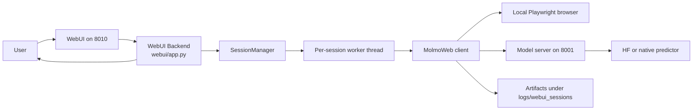

<p align="center">
  
</p>

# MolmoWeb Setup On My Linux Machine

This document captures the Linux workflow that is working in this repository with a conda environment named `molmoweb`.

<details open>
<summary><strong>1. Create And Use The Conda Environment</strong></summary>

```bash
conda create -n molmoweb python=3.10 -y
conda activate molmoweb
conda install -c conda-forge uv -y
```

</details>

<details>
<summary><strong>2. Keep uv And Playwright Inside The Conda Environment</strong></summary>

```bash
export UV_PROJECT_ENVIRONMENT="$CONDA_PREFIX"
export UV_CACHE_DIR="$CONDA_PREFIX/.uv-cache"
export PLAYWRIGHT_BROWSERS_PATH="$CONDA_PREFIX/.playwright"
```

If you want those variables every time the environment is activated:

```bash
conda env config vars set UV_PROJECT_ENVIRONMENT="$CONDA_PREFIX"
conda env config vars set UV_CACHE_DIR="$CONDA_PREFIX/.uv-cache"
conda env config vars set PLAYWRIGHT_BROWSERS_PATH="$CONDA_PREFIX/.playwright"
conda deactivate
conda activate molmoweb
```

</details>

<details>
<summary><strong>3. Install The Python Dependencies</strong></summary>

```bash
uv sync
```

</details>

<details>
<summary><strong>4. Install Playwright Browsers</strong></summary>

```bash
uv run playwright install
uv run playwright install --with-deps chromium
```

On Ubuntu 24.04, Playwright may still request `libasound2`, while the package you actually need is `libasound2t64`.
If `playwright install --with-deps chromium` fails with that package mismatch, run:

```bash
sudo apt-get install -y libasound2t64
uv run playwright install --with-deps chromium
```

</details>

<details>
<summary><strong>5. Download The Model Weights</strong></summary>

Default 8B HF-compatible checkpoint:

```bash
bash scripts/download_weights.sh
```

The downloaded checkpoint lands under:

```bash
./checkpoints/MolmoWeb-8B
```

Useful monitoring commands:

```bash
watch -n 5 'du -sh /home/prerak@medis.local/code/_tmp/molmoweb/checkpoints/MolmoWeb-8B'
watch -n 5 'find /home/prerak@medis.local/code/_tmp/molmoweb/checkpoints/MolmoWeb-8B -maxdepth 1 -name "model-*.safetensors" | wc -l'
```

</details>

<details open>
<summary><strong>6. Start The Model Server</strong></summary>

Start the background server with the Linux helper script:

```bash
bash scripts/start_server_mylinux.sh
```

Example output:

```text
Started MolmoWeb server in background
PID: 123456
PID file: /path/to/repo/logs/molmoweb_server_port_8001.pid
Log file: /path/to/repo/logs/molmoweb_server_port_8001.log
Status URL: http://127.0.0.1:8001/status
Tail logs: tail -f /path/to/repo/logs/molmoweb_server_port_8001.log
```

Custom port:

```bash
bash scripts/start_server_mylinux.sh ./checkpoints/MolmoWeb-8B 8002
```

Custom log file:

```bash
bash scripts/start_server_mylinux.sh ./checkpoints/MolmoWeb-8B 8001 ./logs/custom_molmo.log
```

Stop the background server cleanly:

```bash
bash scripts/stop_server_mylinux.sh
```

The stop script terminates the full process tree, not just the wrapper PID, so stale `uvicorn` workers do not remain bound to the port.

</details>

<details open>
<summary><strong>7. Start The WebUI</strong></summary>

The WebUI runs on port `8010` by default and talks to the model server on port `8001`.

```bash
bash scripts/start_webui_mylinux.sh 8010
```

Example output:

```text
Started MolmoWeb WebUI in background
PID: 123789
PID file: /path/to/repo/logs/molmoweb_webui_port_8010.pid
Log file: /path/to/repo/logs/molmoweb_webui_port_8010.log
URL: http://127.0.0.1:8010
Tail logs: tail -f /path/to/repo/logs/molmoweb_webui_port_8010.log
```

Stop the WebUI cleanly:

```bash
bash scripts/stop_webui_mylinux.sh 8010
```

The stop script also terminates the full process tree for the WebUI.

</details>

<details open>
<summary><strong>8. Restart Both Services</strong></summary>

Use the helper wrapper to stop and restart the model server and WebUI together:

```bash
bash scripts/restart_services.sh
```

Explicit checkpoint and ports:

```bash
bash scripts/restart_services.sh ./checkpoints/MolmoWeb-8B 8001 8010
```

The wrapper waits for both status endpoints before returning success.

</details>

<details>
<summary><strong>9. Check That The Services Are Live</strong></summary>

Model server health:

```bash
curl http://127.0.0.1:8001/status
curl http://127.0.0.1:8001/status?format=json
```

WebUI health:

```bash
curl http://127.0.0.1:8010/api/status
```

Open the UI at:

```text
http://127.0.0.1:8010/
```

Expected JSON shape:

```json
{
  "status": "ok",
  "pid": 123456,
  "project_path": "/home/prerak@medis.local/code/_tmp/molmoweb",
  "log_file": "/home/prerak@medis.local/code/_tmp/molmoweb/logs/molmoweb_server_port_8001.log",
  "port": 8001,
  "checkpoint": "./checkpoints/MolmoWeb-8B",
  "predictor_type": "hf",
  "num_predictors": 1,
  "predictor_queue_size": 1,
  "cuda_device_count": 2,
  "model_load_seconds": 12.345,
  "uptime_seconds": 34.567
}
```

</details>

<details>
<summary><strong>10. Follow Logs Reliably</strong></summary>

Use `tail -F` instead of `tail -f` during restarts.

```bash
tail -F /home/prerak@medis.local/code/_tmp/molmoweb/logs/molmoweb_server_port_8001.log
tail -F /home/prerak@medis.local/code/_tmp/molmoweb/logs/molmoweb_webui_port_8010.log
```

Why:

- `tail -F` keeps following the filename even if the log file is replaced or reopened across restarts.
- `tail -f` only follows the current file handle, which is more fragile during service restarts.
- Startup output can be quiet until actual requests arrive, so an apparently idle WebUI log is not necessarily a failure.

</details>

<details>
<summary><strong>11. WebUI Session Behavior</strong></summary>

- The first prompt in the WebUI auto-creates a new browser session.
- Follow-up prompts reuse the same live browser session.
- Session artifacts are stored in `logs/webui_sessions/`.
- If the browser window is closed manually, the session is marked as no longer live.
- The session console includes a built-in Hazlnut FAQ sample prompt.

Useful WebUI API endpoints:

```text
GET  /api/status
GET  /api/config
GET  /api/sessions
POST /api/sessions
GET  /api/sessions/{session_id}
POST /api/sessions/{session_id}/messages
POST /api/sessions/{session_id}/close
GET  /api/model-service/status
GET  /api/model-service/logs
```

</details>

<details>
<summary><strong>12. Workflow Diagram</strong></summary>



</details>

<details>
<summary><strong>13. Run The Smoke Test</strong></summary>

```bash
conda run --live-stream -n molmoweb bash -lc 'export UV_PROJECT_ENVIRONMENT="$CONDA_PREFIX"; export UV_CACHE_DIR="$CONDA_PREFIX/.uv-cache"; export PLAYWRIGHT_BROWSERS_PATH="$CONDA_PREFIX/.playwright"; uv run python scripts/test_server.py'
```

A successful response observed in this environment was:

```text
Lead Software Engineer, AI Infrastructure; Research Engineer, FlexOlmO; Senior Research Engineer, Olmo; Communications Manager
```

</details>

<details open>
<summary><strong>14. Quick Start With Tilt (macOS / Apple Silicon)</strong></summary>

If you have [Tilt](https://tilt.dev/) installed, the entire stack (setup, model server, WebUI) can be started with a single command. This is the recommended path on macOS with Apple Silicon (no conda required).

**Prerequisites:**

- [uv](https://docs.astral.sh/uv/) installed
- [Tilt](https://tilt.dev/) installed (`brew install tilt-dev/tap/tilt`)
- Model weights downloaded (see step 5, use `allenai/MolmoWeb-4B` for 32 GB machines)

**Start everything:**

```bash
tilt up
```

This runs three resources in order:

1. **setup** -- `uv sync --frozen` and `playwright install chromium`
2. **model-server** -- loads the checkpoint on MPS (Apple Silicon) or CUDA and serves on port `8001`
3. **webui** -- starts the session console on port `8010` (waits for model-server to be ready)

**Dashboard:** open the Tilt UI at `http://localhost:10350` to see logs and health status for each resource.

**Ports:**

| Service | URL |
|---|---|
| WebUI | http://127.0.0.1:8010 |
| Model server status | http://127.0.0.1:8001/status |
| Tilt dashboard | http://localhost:10350 |

**Stop everything:**

```bash
tilt down
```

**Notes:**

- On Apple Silicon with 32 GB RAM, use the 4B model (`allenai/MolmoWeb-4B`). The 8B model fits at float16 (~16 GB) but leaves less headroom.
- The Tiltfile defaults to `checkpoints/MolmoWeb-4B`. To use a different checkpoint, edit `CHECKPOINT` in `Tiltfile` before `tilt up`.
- The `setup` resource installs Playwright Chromium automatically. Without this step, browser sessions will fail with `BrowserType.launch: Executable doesn't exist`.

</details>

<details>
<summary><strong>15. Local Workflow Does Not Require Browserbase Or OpenAI Keys</strong></summary>

The default local path used here does not require:

```bash
export BROWSERBASE_API_KEY=...
export BROWSERBASE_PROJECT_ID=...
export OPENAI_API_KEY=...
```

Those are only needed for optional Browserbase or GPT-based agent paths, not for the local HF server plus local browser workflow above.

</details>
