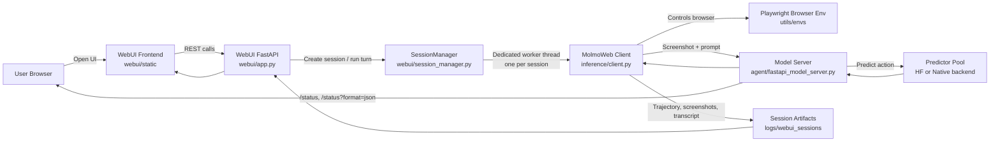

<p align="center">
  
</p>

<p align="center">
  <a href="https://allenai.org/papers/molmoweb">Paper</a> &nbsp;|&nbsp;
  <a href="https://allenai.org/blog/molmoweb">Blog Post</a> &nbsp;|&nbsp;
  <a href="https://molmoweb.allen.ai">Demo</a> &nbsp;|&nbsp;
  <a href="https://huggingface.co/collections/allenai/molmoweb">Models</a> &nbsp;|&nbsp;
  <a href="https://huggingface.co/collections/allenai/molmoweb-data">Data</a>
</p>

---

**MolmoWeb** is an open multimodal web agent built by [Ai2](https://allenai.org). Given a natural-language task, MolmoWeb autonomously controls a web browser -- clicking, typing, scrolling, and navigating -- to complete the task. This repository contains the agent code, inference client, evaluation benchmarks, and everything needed to reproduce the results from the paper.

## Table of Contents

- [Models](#models)
- [Installation](#installation)
- [Quick Start](#quick-start)
  - [Download the Model](#1-download-the-model)
  - [Start the Model Server](#2-start-the-model-server)
  - [Test the Model](#3-test-the-model)
- [Service Endpoints](#service-endpoints)
- [WebUI Sessions](#webui-sessions)
- [Workflow Diagram](#workflow-diagram)
- [Inference Client](#inference-client)
  - [Single Query](#single-query)
  - [Batch Queries](#batch-queries)
  - [Extract Accessibility Tree](#extract-accessibility-tree)
- [License](#license)
- [TODO](#todo)

---

## Models

| Model | Parameters | HuggingFace |
|-------|-----------|-------------|
| MolmoWeb-8B | 8B | [allenai/MolmoWeb-8B](https://huggingface.co/allenai/MolmoWeb-8B) |
| MolmoWeb-4B | 4B | [allenai/MolmoWeb-4B](https://huggingface.co/allenai/MolmoWeb-4B) |
| MolmoWeb-8B-Native | 8B | [allenai/MolmoWeb-8B-Native](https://huggingface.co/allenai/MolmoWeb-8B-Native) |
| MolmoWeb-4B-Native | 4B | [allenai/MolmoWeb-4B-Native](https://huggingface.co/allenai/MolmoWeb-4B-Native) |

The first two models (MolmoWeb-8B and MolmoWeb-4B) are Huggingface/transformers-compatible (see [example usage](https://huggingface.co/allenai/MolmoWeb-8B#quick-start) on Huggingface); and the last two (MolmoWeb-8B-Native and MolmoWeb-4B-Native) are molmo-native checkpoints. 

**Collections:**
- [All MolmoWeb Models](https://huggingface.co/collections/allenai/molmoweb)
- [MolmoWeb Training Data](https://huggingface.co/collections/allenai/molmoweb-data)

---

## Installation

Requires Python 3.10+. We use [uv](https://docs.astral.sh/uv/) for dependency management.

```bash
# Clone and install inside a conda environment named molmoweb
git clone git@github.com:allenai/molmoweb.git
cd molmoweb

# Create and activate the environment
conda create -n molmoweb python=3.10 -y
conda activate molmoweb

# Install uv inside the conda environment
conda install -c conda-forge uv -y

# Tell uv to use the active conda environment instead of creating its own venv
export UV_PROJECT_ENVIRONMENT="$CONDA_PREFIX"
export UV_CACHE_DIR="$CONDA_PREFIX/.uv-cache"
export PLAYWRIGHT_BROWSERS_PATH="$CONDA_PREFIX/.playwright"
uv sync

# Install Playwright browsers (needed for local browser control)
uv run playwright install

# Install extra system packages needed by Chromium on Linux.
# This step installs OS-level packages, not conda packages, so it may prompt for sudo.
uv run playwright install --with-deps chromium
```

On Ubuntu 24.04, `uv run playwright install --with-deps chromium` may fail because
Playwright still requests `libasound2`, while Ubuntu now provides `libasound2t64`.
If that happens, install it manually and then retry:

```bash
sudo apt-get install -y libasound2t64
uv run playwright install --with-deps chromium
```

If you want this behavior every time you activate the environment, you can persist it with:

```bash
conda env config vars set UV_PROJECT_ENVIRONMENT="$CONDA_PREFIX"
conda env config vars set UV_CACHE_DIR="$CONDA_PREFIX/.uv-cache"
conda env config vars set PLAYWRIGHT_BROWSERS_PATH="$CONDA_PREFIX/.playwright"
conda deactivate
conda activate molmoweb
```

---

### Environment Variables

```bash
# Not required for the default local workflow.
# Browserbase is only needed if you explicitly choose a cloud browser instead of local Chromium.
# Browserbase (required only when using Browserbase/local=False)
export BROWSERBASE_API_KEY="your-browserbase-api-key"
export BROWSERBASE_PROJECT_ID="your-browserbase-project-id"

# Google Gemini (required for gemini_cua, gemini_axtree, and Gemini-based judges)
export GOOGLE_API_KEY="your-google-api-key"

# Not required for the default MolmoWeb FastAPI server or local inference client.
# OpenAI is only needed for gpt_axtree and GPT-based judges like webvoyager.
export OPENAI_API_KEY="your-openai-api-key"
```

---

## Quick Start

Three helper scripts in `scripts/` let you download weights, start the server, and test it end-to-end.

### 1. Download the Model

```bash
bash scripts/download_weights.sh                                  # MolmoWeb-8B (default)
bash scripts/download_weights.sh allenai/MolmoWeb-4B-Native       # MolmoWeb-4B Native
```

This downloads the weights to `./checkpoints/<model-name>`.

### 2. Start the Model Server

```bash
# default predictor type is native
bash scripts/start_server.sh ./checkpoints/MolmoWeb-4B-Native       # MolmoWeb-4B-Native
# change to HF-compatible
export PREDICTOR_TYPE="hf"
bash scripts/start_server.sh ./checkpoints/MolmoWeb-8B              # MolmoWeb-8B, port 8001
bash scripts/start_server.sh ./checkpoints/MolmoWeb-8B 8002         # custom port
```

Or configure via environment variables:

```bash
export CKPT="./checkpoints/MolmoWeb-4B-Native"   # local path to downloaded weights
export PREDICTOR_TYPE="native"             # "native" or "hf"
export NUM_PREDICTORS=1                    # number of GPU workers

bash scripts/start_server.sh
```

The server exposes a single endpoint:

```
POST http://127.0.0.1:8001/predict
{
  "prompt": "...",
  "image_base64": "..."
}
```

Wait for the server to print that the model is loaded, then test it.

### 3. Test the Model

Once the server is running, send it a screenshot of the [Ai2 careers page](https://allenai.org/careers) (included in `assets/test_screenshot.png`) and ask it to read the job titles:

```bash
uv run python scripts/test_server.py                        # default: localhost:8001
uv run python scripts/test_server.py http://myhost:8002     # custom endpoint
```

The test script sends this prompt to the model:

> Read the text on this page. What are the first four job titles listed under 'Open roles'?

You can also do it manually in a few lines of Python:

```python
import base64, requests

with open("assets/test_screenshot.png", "rb") as f:
    image_b64 = base64.b64encode(f.read()).decode()

resp = requests.post("http://127.0.0.1:8001/predict", json={
    "prompt": "What are the first four job titles listed under 'Open roles'?",
    "image_base64": image_b64,
})
print(resp.json())
```

---

## Service Endpoints

Main model service, default port `8001`:

```text
POST http://127.0.0.1:8001/predict
GET  http://127.0.0.1:8001/status
GET  http://127.0.0.1:8001/status?format=json
```

- `POST /predict`: model inference for one screenshot + prompt pair.
- `GET /status`: HTML status page when opened from a browser, including GPU memory, active jobs, PID, log file, and checkpoint information.
- `GET /status?format=json`: machine-readable JSON status payload.

WebUI service, default port `8010`:

```text
GET  http://127.0.0.1:8010/
GET  http://127.0.0.1:8010/api/status
GET  http://127.0.0.1:8010/api/sessions
POST http://127.0.0.1:8010/api/sessions
GET  http://127.0.0.1:8010/api/sessions/{session_id}
POST http://127.0.0.1:8010/api/sessions/{session_id}/messages
POST http://127.0.0.1:8010/api/sessions/{session_id}/close
GET  http://127.0.0.1:8010/api/model-service/status
GET  http://127.0.0.1:8010/api/model-service/logs
```

---

## WebUI Sessions

The repository now includes a separate WebUI under `webui/` for multi-turn browser sessions.

- One browser session is created per WebUI session.
- Session artifacts are written under `logs/webui_sessions/<session_id>/`.
- The first completed turn can auto-generate a session title.
- The UI keeps the browser session alive across follow-up prompts.
- If the browser window is closed, the session is automatically marked as archived and no longer appears as live.

Linux helper scripts:

```bash
bash scripts/start_server_mylinux.sh ./checkpoints/MolmoWeb-8B 8001
bash scripts/stop_server_mylinux.sh 8001
bash scripts/start_webui_mylinux.sh 8010
bash scripts/stop_webui_mylinux.sh 8010
```

The stop scripts terminate the full wrapper + child process tree so stale `uvicorn` workers are not left behind.

---

## Workflow Diagram



---

## Inference Client

The `inference` package provides a high-level Python client that manages a browser session and runs the agent end-to-end. The client communicates with a running model server endpoint.

### Single Query

```python
from inference import MolmoWeb

client = MolmoWeb(
    endpoint="SET_UP_YOUR_ENDPOINT",
    local=True,         # True = local Chromium, False = Browserbase cloud browser
    headless=True,
) 

query = "Go to arxiv.org and find out the paper about Molmo and Pixmo."
traj = client.run(query=query, max_steps=10)

output_path = traj.save_html(query=query)
print(f"Saved to {output_path}")
```

### Follow-up Query

```python
followup_query = "Find the full author list of the paper."
traj2 = client.continue_run(query=followup_query, max_steps=10)
```

### Batch Queries

```python
queries = [
    "Go to allenai.org and find the latest research papers on top of the homepage",
    "Search for 'OLMo' on Wikipedia",
    "What is the weather in Seattle today?",
]

trajectories = client.run_batch(
    queries=queries,
    max_steps=10,
    max_workers=3,
) # Inspect the trajectory .html files default saved under inference/htmls
```

### Inference Backends

Supported backends: `fastapi` (remote HTTP endpoint), `modal` (serverless), `native` (native molmo/olmo-compatible checkpoint), `hf` (HuggingFace Transformers-compatible checkpoint).

> **vLLM support coming soon.**

### Extract Accessibility Tree

```
from inference.client import MolmoWeb

client = MolmoWeb()
axtree_str = client.get_axtree("https://allenai.org/")
print(axtree_str)
client.close()
```

---

## License

Apache 2.0. See [LICENSE](LICENSE) for details.

## TODO

- [x] Inference
- [ ] Eval
- [ ] Training
